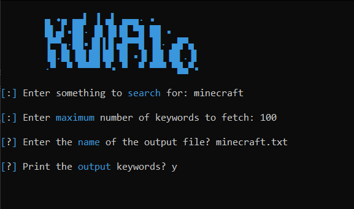

<h1 align="center">
  </a>
  <br>
</h1>

<h4 align="center">Simple KeyWord Shitter.</h4>

<p align="center">
  <a href="#features">Features</a> •
  <a href="#installation">Install</a> •
  <a href="#running-kwTool">Usage</a> •
</p>

---


kwTool is tool that developed by Salman Alwan aka JustFaQ to gather as much accurate keywords as you can. Keywords can be used for dorking and much more, so this might be the tool you are looking for if you need to make handwritten dorks, this tool based on KeyWord Shitter Program, feel free to edit the code. More tools will be added soon, Leave some ideas on my discord, faq#6067.

# Features

<h1 align="left">
  </a>
  <br>
</h1>

 - powerful tool
 - simple ui

 # Usage

```sh
python kwAIO.py
```
This will display help for the tool.

<h1 align="left">
  </a>
  <br>
</h1>


# Installation

igSuck requires:
- python
- colorama
- selenium
- chrome

To install run these comands:
```sh
▶ sudo apt install git
```
```sh
▶ git clone https://github.com/JustFaQ/kwTool.git
```
```sh
▶ cd kwTool
▶ pip install -r requirements.txt
```

# Running igSuck

To run the tool, simply type: 
```sh
▶ python kwAIO.py
```

